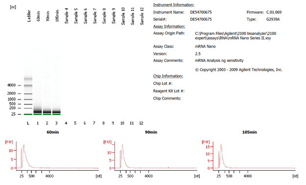
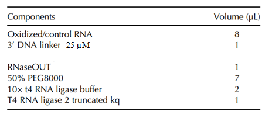
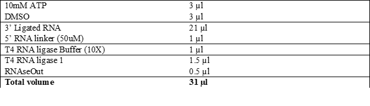
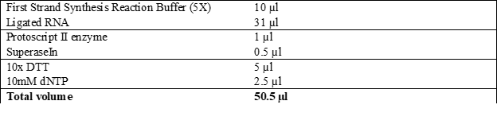
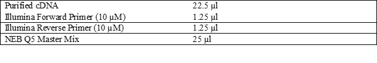
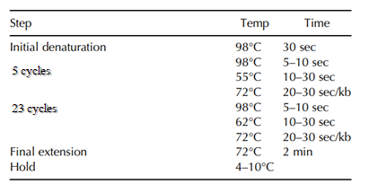
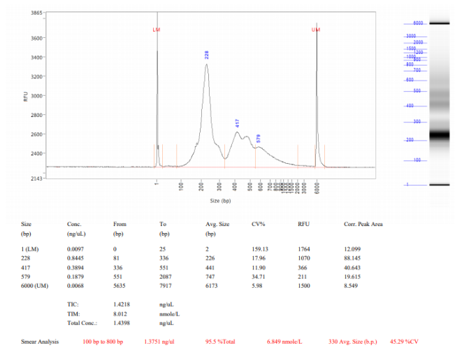

RibOxi-Seq Protocol
================
Yinzhou Zhu
6/7/2020

  - [Method procedures](#method-procedures)
      - [RNA preparation](#rna-preparation)
          - [RNA extraction](#rna-extraction)
          - [Poly(A) enrichment](#polya-enrichment)
      - [RNA fragmentation](#rna-fragmentation)
          - [Pre-fragmentation](#pre-fragmentation)
          - [Fragmentation](#fragmentation)
      - [Oxidation and elimination](#oxidation-and-elimination)
          - [T4 PNK ends repair](#t4-pnk-ends-repair)
          - [Final oxidation](#final-oxidation)
      - [3’ DNA linker ligation](#dna-linker-ligation)
      - [RT-Primer Annealing](#rt-primer-annealing)
      - [5’ RNA linker ligation](#rna-linker-ligation)
      - [Reverse transcription](#reverse-transcription)
      - [PCR amplification of cDNA
        library](#pcr-amplification-of-cdna-library)
      - [Library QC](#library-qc)
  - [Materials](#materials)
      - [Equipment](#equipment)
      - [Reagents](#reagents)
      - [Primers & Oligos](#primers-oligos)

# Method procedures

## RNA preparation

### RNA extraction

1.  Extract total RNA with Trizol.  
2.  Ethanol precipitation into appropriate volume.

### Poly(A) enrichment

3.  Enrich ploy(A) RNA with NEB Next Poly(A) kit.  
    **Note**:The mRNA enrichment step can be substituted with other
    PolyA kits or rRNA depletion kits.

## RNA fragmentation

### Pre-fragmentation

4.  In a 1.5 mL Ependorf tube, dilute 3-5 µg of PolyA enriched RNA into
    44.5 µL with nuclease-free H2O.  
5.  Vortex the mixture and spin for a brief second to collect all liquid
    at the bottom.  
6.  Place the tube into a 90°C heat block for 3 min to denature the RNA
    and immediately place on ice for at least 1 min.

### Fragmentation

7.  Dilute 1 µL stock Benzonase (250 U/µL) into 500 U/mL using 499 µL of
    1× Benzonase buffer. (Always dilute fresh prior to using. Do not
    freeze.)  
8.  Add 5 µL of 10× Benzonase buffer and 0.5 µL of diluted Benzonase to
    the diluted RNA (final RNA concentration: 100 ng/µL). Incubate on
    ice for 90 min.  
9.  Perform phenol–chloroform extraction. Add 50 µL H2O and 100 µL acid
    phenol:chloroform and vortex for 10 sec. Centrifuge at 20,000g at RT
    for 5 min.  
10. Transfer about 95 µL of the supernatant into a new set of Eppendorf
    tubes.  
11. Ethanol precipitate the RNA. Add 10 µL of 3 M sodium acetate (0.1×
    volume). Mix well and add 300 µL of 100% ethanol.  
12. Mix well and place on ice for \>30 min to precipitate RNA.  
13. Spin at max (\>16,000g) at 4°C or RT for ∼30 min.  
14. Carefully remove the ethanol without dislodging the pellet.  
15. Add ≥500 µL 70% ethanol, vortex, and centrifuge for 5 min to wash
    the pellet.  
16. Resuspend pellet in 40 µL of nuclease-free H2O.  
17. Aliquot 1 µg (8 µL) fragmented RNA for each control replicate and
    store at −80°C until the 3’-end ligation step.  
    Note:Can also perform Alkaline hydrolysis instead. Requires one
    extra 3’ de-phosphorylation step  
    

## Oxidation and elimination

18. Freshly prepare 200 mM NaIO4 solution by dissolving 42.78 mg of the
    NaIO4 powder in 1 mL nuclease free water. Protect the solution from
    light.  
19. To the 32 µL RNA, add 4 µL oxidation-elimination buffer and 4 µL of
    prepared NaIO4 solution (keep the remaining on ice if more cycled to
    be performed). Mix well and incubate at 37°C protected from light
    for 45 min (better if a continuous vortexer is available).  
20. Adjust the volume to 50 µL with nuclease-free H2O.  
21. Purify RNA using Zymo RNA Clean concentrator into 34uL volume **(
    \*\*\* 42uL for final end repairs)**.  
22. Add 4 µL of Antarctic phosphatase buffer and 2 µL enzyme to RNA.
    Incubate at 37°C for 30 mins and 80°C for 2 mins.  
    23 .Purify RNA using Zymo RNA Clean concentrator into 32uL volume.  
23. Repeat Oxidation-elimination and De-phosphorylation desired number
    of times.

### T4 PNK ends repair

25. Add 5µL 10X PNK buffer (PH 6), 1 µL SuperaseIn and 2 µL T4 PNK to
    the 42uL oxidized RNA. (Important: The PNK buffer used must not
    contain ATP.)  
26. Incubate at 37°C for at least 4 h.  
27. Add 5µL 10X PNK buffer (NEB original buffer), 10uL 10mM ATP, 1uL T4
    PNK and 34µL H2O. Incubate at 37°C for 1h.  
28. Ethanol precipitate RNA and store in EtOH until ready to continue
    onto final oxidation.

### Final oxidation

29. Ethanol precipitate Ox samples into pellete (with help of 1 µL LPA).
    Perform a final oxidation by adding 35 µL Oxidation-only buffer and
    5 µL of NaIO4 in Oxidation only buffer (Incubate at RT for 45
    minutes).  
30. Purify oxidized sample using Zymo RNA Clean concentrator
    (cincentrator-5 recommended) into 8uL volume.

## 3’ DNA linker ligation

31. Thaw the control samples and dilute each into 8 µL. Transfer into
    PCR tubes.  
32. Transfer 8 µL of each oxidized sample into PCR tubes.  
33. Ligation of 3’ linker (Use higher PEG concentration if possible).  
34. Incubate the reaction in thermal cycler at 16°C overnight for 18
    h.  
    

## RT-Primer Annealing

35. Add 1 µL of 25 µM RibOxiRT\_Alt primer and anneal in thermal-cycler
    using the following program:  
    5 minutes at 75°C  
    15 minutes at 37°C  
    15 minutes at 25°C  
    Hold at 4°C

## 5’ RNA linker ligation

36. Thaw 50 µM RNA linker from −80°C and transfer (number of samples) X
    1.3 µL into a PCR tube.  
37. Denature RNA linker at 72°C for 2 min and return to ice.  
38. Prepare the following ligation reaction and incubate at 25°C for 1
    h.  
    

## Reverse transcription

39. Prepare RT reactions to generate a cDNA library.  
40. Incubate the reactions in thermal-cycler following Protoscript II
    protocol(setup on ice and directly incubate @48°C).  
41. Hydrolyze remaining RNAs by adding 5.5 µL of 1 N NaOH and incubate
    at 98°C for 20 min.  
42. Add 5.5 µL 1M Tris-HCl PH = 7.0 to neutralize the PH.  
43. Use Ampure XP beads at 1:1.8 ratio (add 108 µL Ampure XP solution).
    Incubate for 5 min to let beads bind cDNA of 100bp or larger.  
44. Finish Ampure XP purification.  
45. Elute using EB buffer into 22.5 µL volume.  
    

## PCR amplification of cDNA library

46. Prepare NEB Q5 PCR reactions and incubate in the thermocycler using
    the following program modified from the Q5 protocol.  
47. Add 50 µL of AmpureXP to achieve a 1:1 ratio to select for fragment
    of sizes ∼200 bp and above, reducing the amount of non-insert
    fragments (Illumina i5 sequence: ∼70 bp, Illumina i7 sequence: ∼66,
    3’-linker sequence: 23bp, total empty-insert product: ∼170 bp).  
48. Purify libraries following the AmpureXP protocol. Resuspend each
    sample in 15 µL with Illumina RSB or nuclease free water.  
    

## Library QC

Here are the representative outcome of the library prep for both control
and oxidized samples. 

# Materials

## Equipment

  - Table top centrifuge  
  - Programmable thermal cycler  
  - Heat blocks/water baths  
  - NanoDrop 2000 UV-Vis Spectrophotometer (Thermo Fisher Scientific,
    ND-2000)  
  - Agilent Bioanalyzer 2100

## Reagents

  - Ultra-pure Benzonase (Sigma, E826305KU)
  - 10× Benzonase buffer (store at 4°C)
  - 3 M sodium acetate pH = 5.2
  - Ethanol 100%
  - Ethanol 70%
  - UltraPure Phenol:Chloroform:Isoamyl Alcohol (25:24:1, v/v) (Thermo
    Fisher Scientific, 15593031)
  - Acid-Phenol:Chloroform, pH 4.5 (with IAA, 125:24:1) (Thermo Fisher
    Scientific, AM9720)
  - RNA Clean \&Concentrator (Zymo, DS1017)
  - Linear polyacrylamide 10 µg/µL (Mullins Molecular Retrovirology Lab
    Short protocol)
  - Sodium meta-periodate (Sigma-Aldrich, 7790-28-5)
  - Oxidation-only buffer: 4.375 mM sodium borate, 50 mM boric acid, pH
    = 8.6
  - Oxidation-elimination buffer: Lysine-HCl buffer, 2 M, pH 8.5:
    Dissolve 3.653 g of L-Lysine monohydrochloride in 10 ml of molecular
    biology grade, RNase-free water. Titrate to pH 8.5 with Sodium
    hydroxide.
  - T4 Polynucleotide Kinase (NEB, M0201L)
  - SUPERase• In RNase Inhibitor 20 U/μL (Thermo Fisher Scientific,
    AM2696)
  - RNaseOUT Recombinant Ribonuclease Inhibitor (Thermo Fisher
    Scientific, 10777019)
  - T4 RNA Ligase 2, truncated KQ (NEB, M0373S)
  - T4 RNA Ligase 1 (NEB, M0204S)
  - DMSO 100%
  - Sodium hydroxide 1 N
  - EB buffer: 10 mM Tris-Cl, pH 8.5
  - Q5 High-Fidelity 2× Master Mix (NEB, M0492S)
  - Agencourt AMPure XP, 450 mL (Beckman Coulter Life Sciences, A63882)
  - Antarctic Phosphatase and Reaction Buffer (10X) (NEB, M0289S)
  - NEB Protoscript II Reverse Transcriptase (NEB, M0368S)

## Primers & Oligos

  - NEB miRNA linker (3’- linker) 5´-/rApp/CTGTAGGCACCATCAAT/NH2/- 3´  
  - RibOxi RT Primer
    5’-GTGACTGGAGTTCAGACGTGTGCTCTTCCGATCTNNNNNNATTGATGGTGCCTACAG-3’  
  - 5’RNA linker 5’-/Biosg/ACACUCUUUCCCUACACGACGCUCUUCCGAUCUNNNN-3’  
  - PCR\_i5
    5’-aatgatacggcgaccaccgagatctacac-i5(8nt)-acactctttccctacacgacgctcttccgatct-3’  
  - PCR\_i7
    5’-caagcagaagacggcatacgagat-i7(8nt)-gtgactggagttcagacgtgtgctcttccgatct-3’
